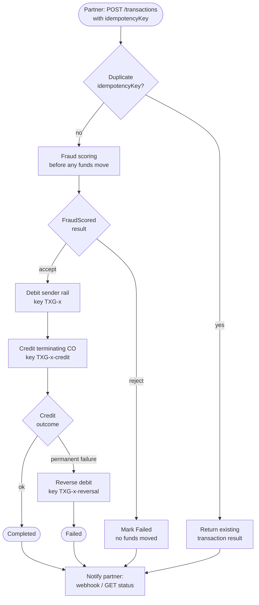

# Flow: Transaction Processing

How a partner-initiated transaction moves through TxGuard — from request, through
fraud scoring and the debit/credit legs, to a terminal `Completed` or `Failed` state,
with saga-style compensation on permanent credit failure.

## Overview

A partner submits a transaction with **their own `idempotencyKey`**. TxGuard scores
it for fraud **before any funds move**, debits the sender rail, then credits the
terminating cash-out (CO). On a permanent credit failure, the debit is reversed so
funds are never stranded. The partner learns the outcome asynchronously via webhook
or by polling `GET` status.

## Idempotency keys

The partner's `idempotencyKey` maps to one TxGuard transaction (`TXG-x`). Each
sub-operation gets a deterministic derived key, so any leg can be retried safely
without double-moving funds:

| Operation | Idempotency key |
|---|---|
| Debit sender rail | `TXG-x` |
| Credit terminating CO | `TXG-x-credit` |
| Reverse debit (compensation) | `TXG-x-reversal` |

## Diagram

## Key design points

- **Fraud scoring is a gate** — it runs before the debit, so a flagged transaction
  never moves money.
- **Compensating action** — a permanent credit failure triggers a reversal of the
  debit (saga-style compensation), landing in `Failed` rather than leaving funds on
  the sender rail.
- **Idempotency chain** — the partner key `TXG-x` derives keys for every leg, making
  the whole flow safe to retry.
- **Async result delivery** — the partner learns the outcome by webhook (push) or by
  polling `GET` status (pull).

_Source: architecture flow provided by the team_
